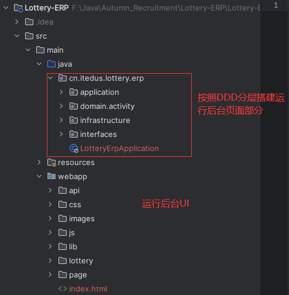
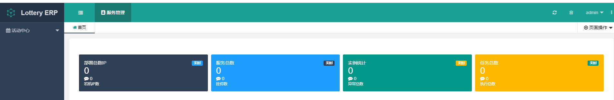
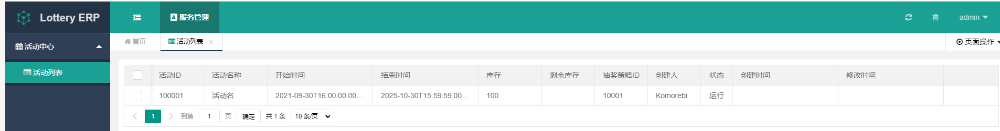

# 1. 前端选型

- 三套 UI 运营后台方案，分别是：[layuion](https://www.layuion.com/)、[vue-element-admin](https://panjiachen.github.io/vue-element-admin/#/permission/directive)、[preview.pro.ant.design](https://preview.pro.ant.design/dashboard/analysis?navTheme=light&primaryColor=%231890ff&layout=mix&fixSiderbar=true&title=Ant+Design+Pro)
- 为了使用起来更加方便和容易上手，这里选择了 layui 作为运营后台的搭建框架，后续在开发对C端的抽奖页面的时候再使用 vue 语言，当然如果对 vue 很感兴趣，也可以在这里使用 vue 的方式进行运营后台页面搭建。

# 2. 搭建运营后台

虽然 layui 已经下线了，但对于日常使用其实也够用了，当然如果希望后续更好的扩展，那么使用 vue 搭建也是可以的。这里小傅哥选择 DDD 架构分层结构 + layui 搭建运营后台工程；

- 之所以搭建 DDD 结构是因为这里是 DDD 在没有 RPC 引入的时候，更为紧凑的结构模型，可以在这里体现给大家。它的整个结构你可以看到 Application 应用层定义接口在 Domain 领域层做实现，最终交给 interfaces 接口层使用。

- ui 方便我们这里不是前后端分离的，而是直接放到工程中，算是一种比较`古老`的实现方式，但在开发内部使用的运营后台还是非常合适的，因为一般运营后台只是内部运营人员使用，通常部署2台应用实例做个互备就可以了。

# 3. 页面效果

